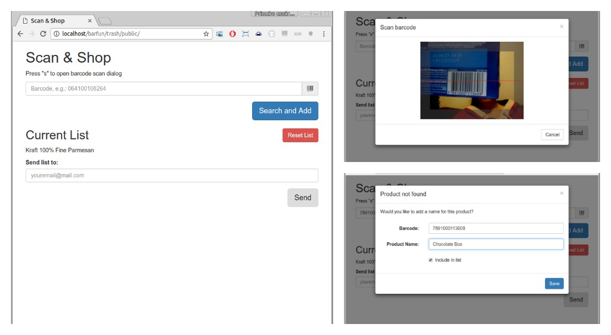

# Scan & Shop :memo:

Scan & Shop is a small app to build a shop list based on barcodes, then send it via e-mail. It's built on top of Laravel and strives to be as simple as possible.

Basic Flow:
1. Scan (with webcam or cam phone) or type a barcode
1. Click `Search and Add`
1. If product is not found, enter its name
1. When you're about to go shopping, fill your e-mail and send it to you.

This is still a work in progress with not many providers for barcode to
 product name, but more are to follow soon.

## Screenshot



## Limitations

- Only three barcode to product name providers implemented so far
- Setting up requires a bit of command line, but with the user system in place there'll be a hosted
version soon.

## Configuration

As this is mostly a personal project still, I was using keys associated to my
 accounts for barcode api and email providers, so even though they will work
 if you try the code out of the box, you might run into weird issues, so I recommend you set up your own accounts.

All API keys are stored in the `.env` file, at the end. E-mail is handled by
 Mailgun.

1. [UPCDatabase](https://www.upcdatabase.com/xmlrpc.asp) - Create an account, then go to Account Info to retrieve the key.
1. UPCItemDb - No need for key in trial mode.
1. [SearchUPC](http://www.searchupc.com/) - Create an account, then retrieve your access token.
1. [Mailgun](https://mailgun.com) - Create an account, set up a domain or use the sandbox domain.

## Setup

First create the database:
```
$ mysql -u user -p -e 'CREATE DATABASE IF NOT EXISTS scanandshop'
```

```
$ make
```

It will run everything necessary to get the app up and running.

## Running

If you just want to run locally, all you need are the [Laravel requirements](https://laravel.com/docs/5.3/installation#server-requirements) installed. Then run:

```
$ php artisan serve
```

A server will be set up in `http://localhost:8000`. It can also be served by
 Apache or Nginx.

## Contributing

All the help is appreciated! :smile:

Code, specially JS, is still kinda messy. As Laravel itself recommends, a
Homestead environment is easier to get going, although it's not required. Right now my next steps are:
- [x] User System
- [ ] Hosted version
- [ ] Choose between different cameras (e.g. mobile)
- [ ] Improve testing, both functional and unit
- [ ] Write more providers

Dependencies are managed by composer and npm, and gulp is used to generate CSS from sass files. When dealing with the CSS, it's recommended to run gulp in watch mode:

```
$ gulp watch
```

If you introduce a feature, please also try to add a test so I don't break it later.

## Tests

Some unit tests are provided in `tests` but more are to follow. They require `phpunit`. Run them using `make test`.

## Acknowledgments

Big thanks and kudos to:

- @yuridelendik for [zbarjs](https://github.com/yurydelendik/zbarjs)
- @jazzido for this [really cool gist](https://gist.github.com/jazzido/9435670)

## License

Scan & Shop is licensed under the [AGPL](https://www.gnu.org/licenses/agpl-3.0.html)
